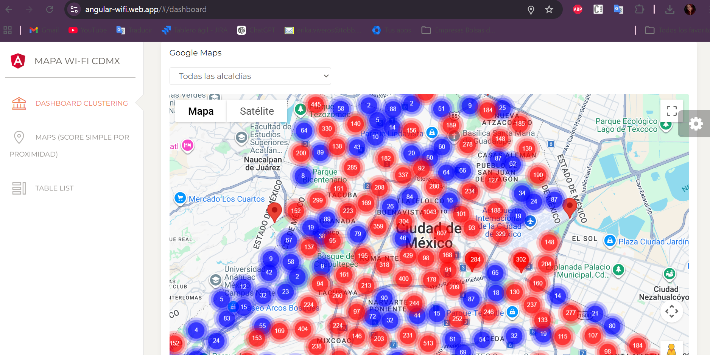
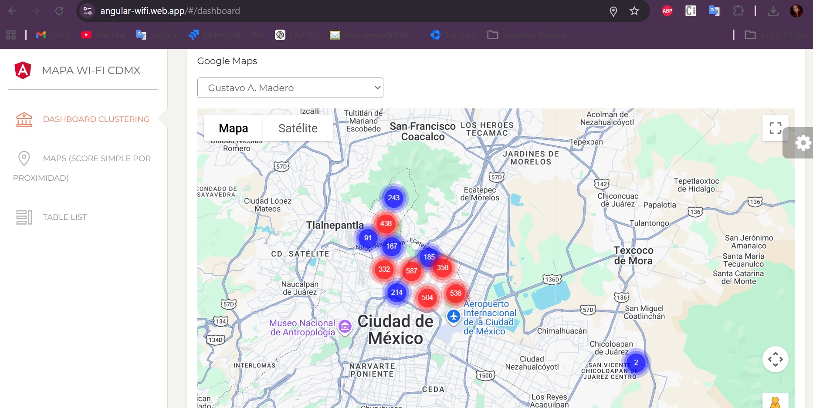
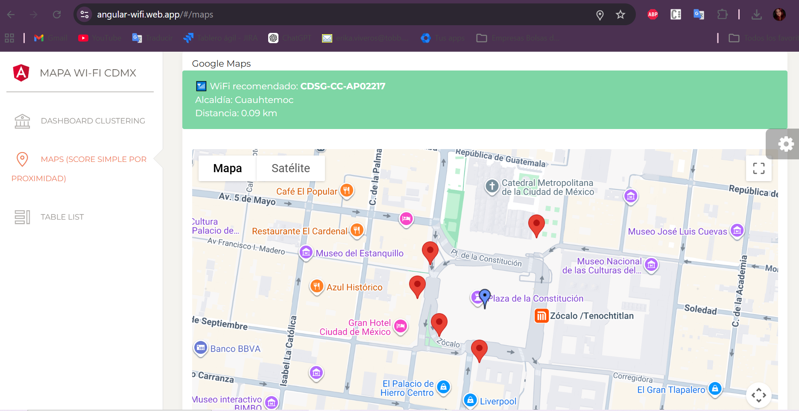
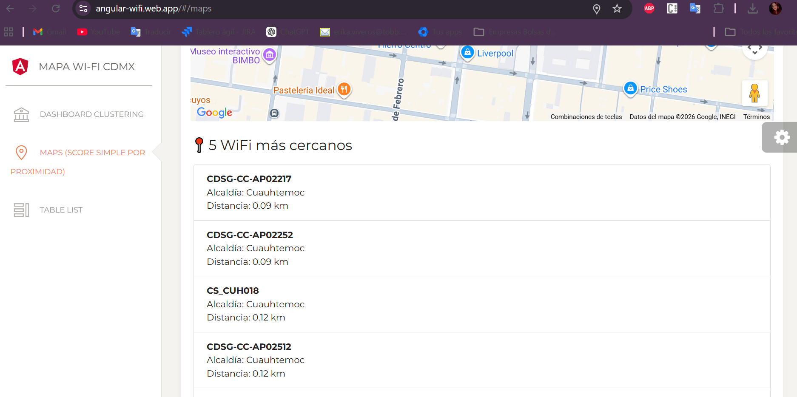
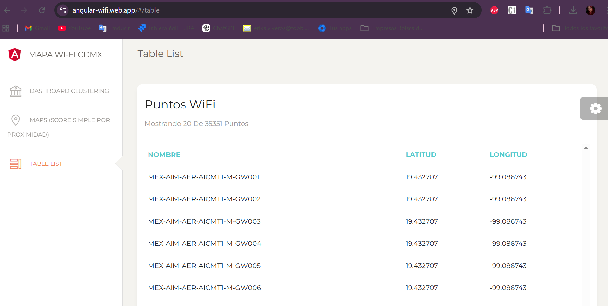
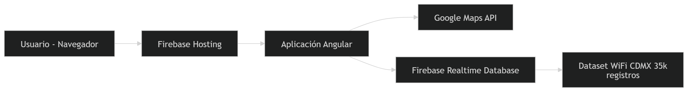
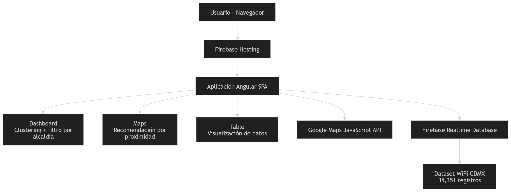

📡 Mapa Wi-Fi CDMX

Aplicación web desarrollada con Angular y Firebase que permite visualizar más de 35,000 puntos Wi-Fi públicos de la Ciudad de México en un mapa interactivo, incluyendo funcionalidades de filtrado por alcaldía, clustering de marcadores y recomendación de puntos cercanos basada en geolocalización del usuario.

🔗 URL pública:
https://angular-wifi.web.app/#/

🎯 Reto elegido y alcance

El proyecto implementa el reto "Mapa Wi-Fi CDMX + recomendación", cuyo objetivo es mostrar los puntos de acceso Wi-Fi públicos en la Ciudad de México y recomendar ubicaciones cercanas al usuario.

Funcionalidades implementadas

✔ Visualización de más de 35,000 puntos Wi-Fi en un mapa.
✔ Clustering de marcadores para mejorar la visualización con grandes volúmenes de datos.
✔ Filtro por alcaldía para explorar zonas específicas.
✔ Recomendación de puntos cercanos basada en la ubicación del usuario.
✔ Cálculo de distancia aproximada entre el usuario y los puntos Wi-Fi.
✔ Vista de tabla con registros del dataset.

Secciones de la aplicación

Dashboard
    Mapa con clustering
    Filtrado por alcaldía

Maps
    Obtiene la ubicación del usuario
    Calcula los 5 puntos Wi-Fi más cercanos
    Muestra el punto del usuario y los puntos recomendados

Table
    Muestra la cantidad total de puntos Wi-Fi
    Lista los primeros 20 registros

🧱 Arquitectura

La aplicación sigue una arquitectura basada en frontend SPA con servicios externos.

Usuario (Navegador)
        │
        ▼
Firebase Hosting
        │
        ▼
Aplicación Angular
   │           │
   ▼           ▼
Google Maps   Firebase
JavaScript    Realtime Database
API

Componentes principales

Angular Frontend
    Renderiza la interfaz
    Maneja navegación y lógica de UI

Google Maps API
    Renderiza el mapa
    Maneja marcadores y clustering

Firebase Realtime Database
    Almacena el dataset de puntos Wi-Fi 

Firebase Hosting
    Publica la aplicación web

🧰 Tecnologías y dependencias

    Angular

    TypeScript

    Firebase Hosting

    Firebase Realtime Database

    Google Maps JavaScript API

    Marker Clustering

    Bootstrap (Paper Dashboard Template)

✔ Compatibilidad
    Node 18+
    Angular 17+

🗄 Modelo de datos

La información de los puntos Wi-Fi proviene de un dataset público y se almacena en Firebase Realtime Database.

Ejemplo de registro:
{
  "id": "MEX-AIM-AER-AICMT1-M-GW001",
  "programa": "Aeropuerto",
  "latitud": "19.432707",
  "longitud": "-99.086743",
  "alcaldia": "Venustiano Carranza"
}

El dataset contiene aproximadamente 35,351 registros.

🧭 Estado y navegación

La aplicación utiliza Angular Router para manejar la navegación entre vistas.

Rutas principales:
/dashboard → mapa con clustering y filtro por alcaldía
/maps → recomendación de Wi-Fi cercano al usuario
/table → visualización de registros en tabla

⚙️ Decisiones técnicas

Uso de clustering
    Debido al gran volumen de datos (35k puntos), se implementó clustering de marcadores para mejorar rendimiento y legibilidad del mapa.

Uso de Firebase Realtime Database
    Se eligió Firebase para almacenar el dataset y permitir una integración sencilla con Angular.

Aplicación pública sin autenticación
    Debido a que los datos son públicos, no se implementó autenticación.

Recomendación basada en proximidad
    Se calculan las distancias entre el usuario y los puntos Wi-Fi y se muestran los cinco más cercanos.

🔐 Seguridad y validaciones

Las reglas de Firebase son:

{
 "rules": {
   ".read": true,
   ".write": false
 }
}

Esto permite:
    acceso público de lectura
    evitar modificaciones en la base de datos

⚡ Rendimiento

Para mejorar la experiencia con grandes volúmenes de datos se implementaron:
    Clustering de marcadores
    Renderizado dinámico en Google Maps
    Visualización limitada de registros en tabla

♿ Accesibilidad

Se tomaron en cuenta algunos principios básicos de accesibilidad:
    Navegación clara entre secciones
    Uso de contraste adecuado en los mapas
    Información textual acompañando los marcadores

📈 Escalabilidad y mantenimiento

El sistema puede escalar mediante:
    paginación en la vista de tabla
    consultas por zona geográfica
    implementación de índices en base de datos
    migración a Firestore si se requiere mayor flexibilidad en consultas

🤖 Uso de IA

La inteligencia artificial fue utilizada como apoyo en varias etapas del desarrollo:

    selección del reto a implementar 
        "Tengo esta lista de proyectos *lista*, cuál consideras que sea un reto? 2.- Crees que para el que consideraste un reto pueda ayudarme a hacerlo al 100%? 2.- Crees que para el que consideraste un reto necesite buscar una plantilla o sería mejor hacer el diseño completo? Ten en cuenta que tengo max de entregar el viernes"

    generación de ejemplos de código
        "Si, quiero que me enseñes a hacerlo, ademas de eso solo ten en cuenta que radico en córdoba y no podría probar la proximidad a menos que se lo mande a alguien que sepa que vive por alla o dame opciones de prueba, Otra cosa, que es más retador de las 3 opciones que me dieron a elegir para hacer :clustering / score simple por proximidad / lista ordenada por score?"

    integración de Google Maps API
        "¿Cómo integrar Google Maps JavaScript API en un proyecto Angular para mostrar marcadores a partir de coordenadas almacenadas en Firebase Realtime Database?"

    implementación de clustering
        "1.- Es normal que salgan de color rojo y azul? 2.- A que te refieres con los colores verde, naranja y rojo? 3.- Y estas mejoras que mencionaste "const bounds = new google.maps.LatLngBounds(); this.markers.forEach(marker => { bounds.extend(marker.getPosition()); }); this.map.fitBounds(bounds);" y esta "this.cluster = new MarkerClusterer({ map: this.map, markers: this.markers, algorithmOptions: { maxZoom: 15 } });" en qué beneficia y en donde irían?"

    cálculo de proximidad entre ubicaciones
        "Si me gusta como se ve cuando selecciono alcaldías, el problema es que al principio señalaba a la ciudad de mexico const cdmx = new google.maps.LatLng(19.4326, -99.1332); y ahora me aparece mucho mas de lejos y hasta que filtro, se acerca"

    configuración de Firebase y despliegue
        "Visualmente ya quedó lo principal, todavia me falta configurar lo que va a hacer la página web, necesito subirlo antes a Firebase (Hosting/App Hosting), Firestore o Realtime DB, no sé cual sea la mejor opción o después de programar?"

    También se utilizó para resolver errores técnicos durante el desarrollo.
        "Te voy a hacer una pregunta que siento que no tiene mucho que ver con lo que estaba haciendo pero en #/maps, tengo el mismo mapa con los puntos y cuando selecciono #/dashboard donde esta el clustering no me muestra el mapa y regreso a la otra ventana y ya no se muestra tampoco el mapa, sabes a que se debe? algo de lo configurado hace que no se muestre el mapa hasta que recargo la página?

Se mantuvo una revisión manual del código generado para asegurar su funcionamiento y adaptación al proyecto.

🚀 Instalación y ejecución

1️⃣ Clonar repositorio: git clone [URL_DEL_REPOSITORIO]
2️⃣ Instalar dependencias: npm install
3️⃣ Ejecutar aplicación: ng serve / npm start
4️⃣ Abrir en navegador: http://localhost:4200

🚀 Despliegue

La aplicación se despliega en Firebase Hosting.

Pasos principales:
    firebase login
    firebase init
    firebase deploy

⚠ Limitaciones

    No permite agregar nuevos puntos Wi-Fi

    No cuenta con paginación avanzada

    No incluye búsqueda en tabla

🔮 Mejoras futuras

    búsqueda por nombre o coordenadas

    paginación en tabla

    filtros adicionales

    optimización de consultas por región
